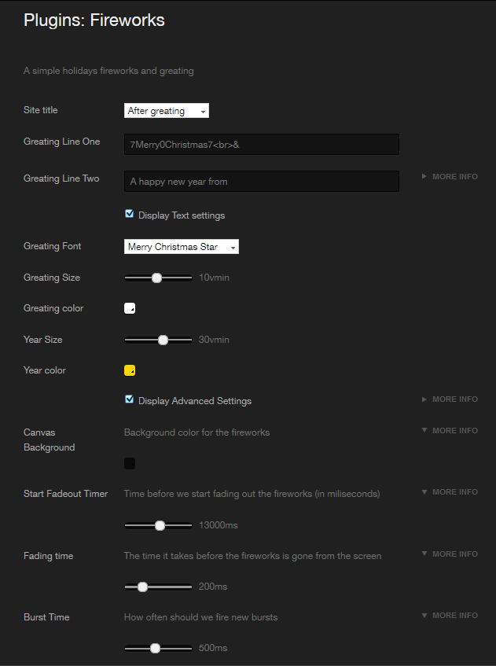
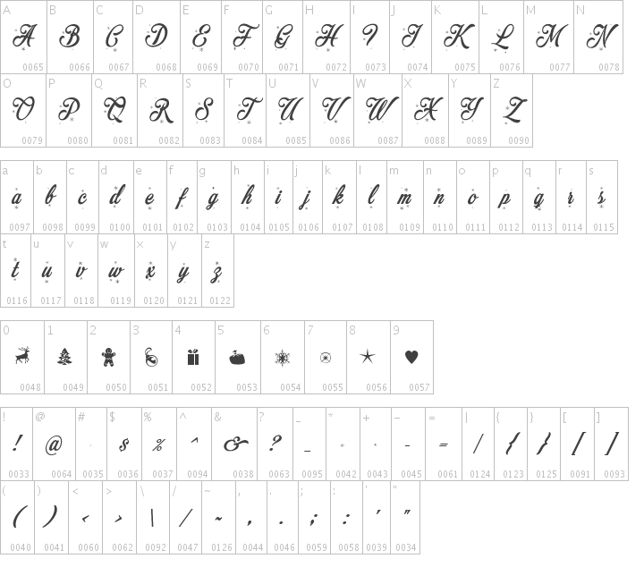

# Fireworks for Koken
Fireworks is a simple javascript and CSS plugin for the [koken cms](https://koken.me) that comes with decorative Christmas and New Year's Eve typeface.

## Demo & Documentation
* [Fireworks Demo](https://varoystrand.se/sidor/fireworks_for_koken/#fireworksDemo)
* [Documentation](https://varoystrand.se/sidor/fireworks_for_koken/)

## Features
* Colorful holidays firekworks
* Customizable greating message
* Custom Xmas:ish [fontface](#christmas-fontface-character-map)
* Fluid and responsive font sizes
* Only displayed once per visit/browser session
* Automaticly updates the year
* Automaticly runs between predefined dates

## Installation

1. Upload the "Fireworks" folder to the `/storage/plugins/` directory
2. Activate the plugin through the 'Plugins' menu in Koken
3. Customize the greating message to your liking

4. And Done

### Merry Christmas Fontface Character Map

### Credits

* The original JS and inspiration comes from: [Fireworks - Happy 2019!](https://codepen.io/TC5550/pen/NejPqE) [by: Alfons Nilsson](https://aaserver.net) @TheCoder5550
* [Merry Christmas fontface](https://www.mansgreback.com/fonts/merry-christmas/) by [Måns Grebäck](http://www.aringtypeface.com/)
* preview image comes from: [Epic Fireworks](https://www.flickr.com/photos/epicfireworks/8058678846) and is used under [CC licensing](https://creativecommons.org/licenses/by/2.0/).
